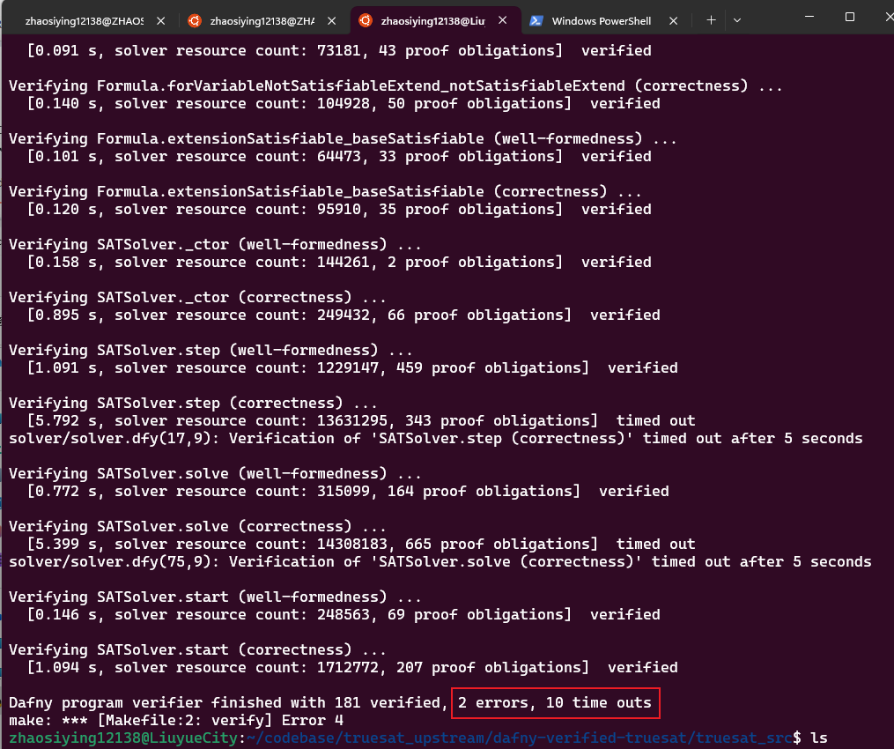
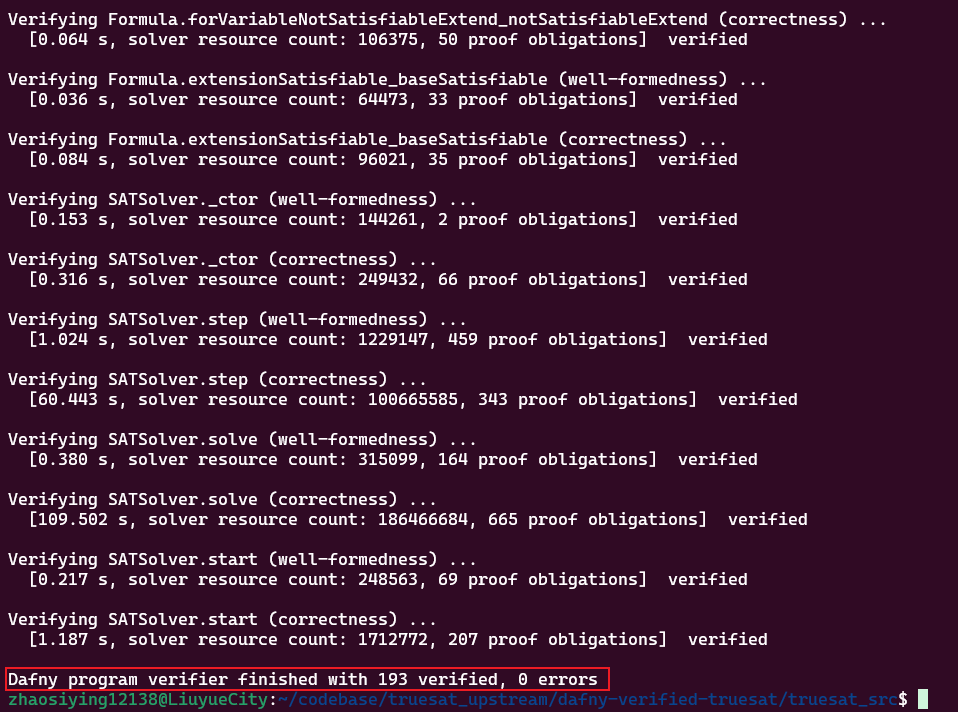
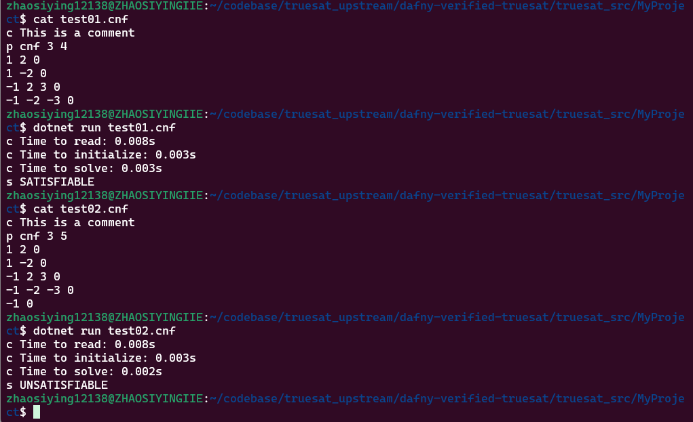

# Truesat: a Dafny-Verified-DPLL
This project aimed to make a predecessors' research, the Dafny-Based implementation of DPLL[1], verified and built fully sucessfully on the latest Dafny 4.6.0  

## 1. Usage  
```
make build -j 65535
dotnet new console -o MyProject
cd MyProject
cp ../*.cs .
dotnet build
dotnet run test01.cnf
```

## 2. Logs  
### 1. Initially, after some superficial modifications, it still has verify many errors and timeout
  
### 2. Final results after looking closely to the codes, for more information please read my Zhihu blog
  
### 3. dotnet run logs
  

## 3. Link  
[《如何基于Dafny实现一个DPLL算法？》-流霞祭司曌鹓鶵](https://www.zhihu.com/question/651527130/answer/3453546974)  
  

## 4. Acknownledgement  
[Andrici C C, Ciobâcă Ș. A Verified Implementation of the DPLL Algorithm in Dafny[J]. Mathematics, 2022, 10(13): 2264.](https://github.com/andricicezar/truesat)  

## 5. Copyright  
Copyright (c) 2022-2024 By 流月城先进偃甲技术研究院-对伏羲外包国家重点实验室-雾魂泉守曌鹓鶵 founded by 五色石炼制关键工艺天界自然科学基金(2022LYC12138).  All rights reserved.  
