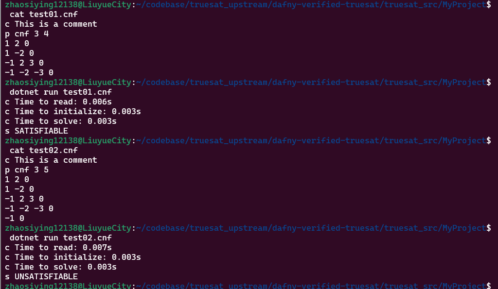

# Dafny-Verified-Truesat
I try to make a Dafny-Based implementation of DPLL verified and built sucessfully on Dafny 4, however, it currently has 2 verify errors and 10 timeouts.  

## 1. Usage  
```
make build
dotnet new console -o MyProject
cd MyProject
cp ../*.cs .
dotnet build
dotnet run test01.cnf
```

## 2. Logs  
### 1. make verify
  
### 2. dotnet run
  

## 3. Acknownledgement  
[Andrici C C, Ciobâcă Ș. A Verified Implementation of the DPLL Algorithm in Dafny[J]. Mathematics, 2022, 10(13): 2264.](https://github.com/andricicezar/truesat)  

## 4. Copyright  
Copyright (c) 2022-2024 By 流月城先进偃甲技术研究院-对伏羲外包国家重点实验室-雾魂泉守曌鹓鶵 founded by 五色石炼制关键工艺天界自然科学基金(2022LYC12138).  All rights reserved.  
